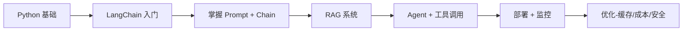

# 前言

`LangChain 1.0 入门学习`

> 参考文档：[https://docs.langchain.com/oss/python/learn](https://docs.langchain.com/oss/python/learn)



---

## 实战步骤

| 阶段  | 你能做什么？ |
| --- | --- |
| **实战入门** | 调用大模型、做简单问答、写脚本自动化 |
| **实战高阶** | 构建企业级 AI 应用、处理私有数据、支持多工具协同、可部署可维护 |

---

# 一、安装

## 1. 基础工具

1. **安装 Python**
  
  [https://www.python.org/](https://www.python.org/)
  
2. **安装 Anaconda**
  
  [https://www.anaconda.com/](https://www.anaconda.com/)
  
3. **安装 Visual Studio Code**
  
  [https://code.visualstudio.com/](https://code.visualstudio.com/)
  
4. **安装 Git**
  
  [https://git-scm.com/](https://git-scm.com/) `I`
  

---

## 2. 开发环境

### 1. 创建 Conda 环境

打开 **开始菜单 → Anaconda Prompt**，执行以下命令：

```bash
# 创建环境 指定python版本
(base) C:\Users\xing12.liu> conda create -n langchain_env python=3.14
# 激活环境
(base) C:\Users\xing12.liu> conda activate langchain_env
# 激活环境成功
python -c "import sys; print(sys.executable)"
(langchain_env) C:\Users\xing12.liu>
```

**根据需要可以调整到指定版本的 Python**（例如降级到 3.11）：

```bash
(langchain_env) C:\Users\xing12.liu>conda install python=3.11
```

**conda 会自动解析依赖并提示变更**，输入 `y` 确认即可。

**验证版本**：

```bash
(langchain_env) C:\Users\xing12.liu>python --version
```

```bash
# 查看 Conda 环境列表
conda env list
# 或
conda info --envs
# 删除前解绑
conda deactivate
# 删除 Conda 环境
conda env remove -n 环境名
# 在 Conda 中 不能直接重命名环境，但可以通过 克隆 + 删除 的方式安全地“重命名”一个 Conda 环境。
conda create -n my_langchain --clone langchain_env
```

### 2. 切换到工作目录

```bash
cd D:\Work\Workspace\AIProjects\Agent\langchain1.0-demo
```

### 3. 启动VSC 或者 PyCharm

```bash
code .
```

---

## 3. 安装 LangChain 核心包

打开 **开始菜单 → Anaconda Prompt**，**激活环境**并进入项目目录：

```bash
(base) C:\Users\xing12.liu> conda activate langchain_env

(langchain_env) D:\Work\Workspace\AIProjects\Agent\langchain1.0-demo
```

安装核心依赖：

```bash
pip install langchain

pip install langchain-community
```

> 由于你使用的是 **Anaconda 环境**，建议：

| 包类型 | 推荐安装方式 |
| --- | --- |
| 科学计算、C 扩展包（如 `zstandard`, `pydantic-core`） | `conda install -c conda-forge` |
| LangChain 生态（`langchain`, `langchain-openai`） | `pip install`（因更新快） |

混合使用时，**先用 conda 装底层依赖，再用 pip 装上层应用**。

---

## 4. 安装 Ollama

1. **安装 Ollama**
  
  https://ollama.com/
  
2. **下载模型**
  
  https://ollama.com/search
  
  - **聊天模型**

```bash
ollama pull deepseek-r1:1.5b

ollama pull llama3.2:3b
```

- **嵌入模型**

```bash
ollama pull nomic-embed-text
```

- **查看已安装模型**

```bash
ollama list
```

3. **安装 LangChain-Ollama 集成包**

```bash
pip install langchain-ollama
```

---

## 5. 安装 DeepSeek API 接口

```bash
pip install langchain-deepseek
```

---

## 6. 安装向量数据库

```bash
pip install chromadb

pip install langchain-chroma
```

---